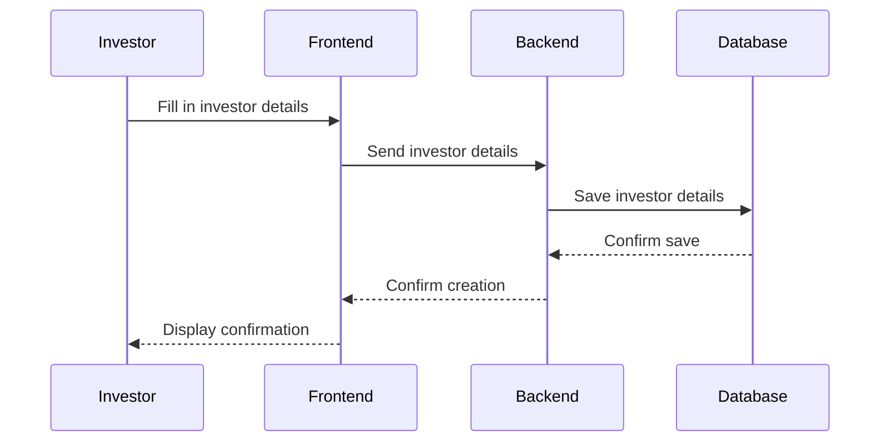
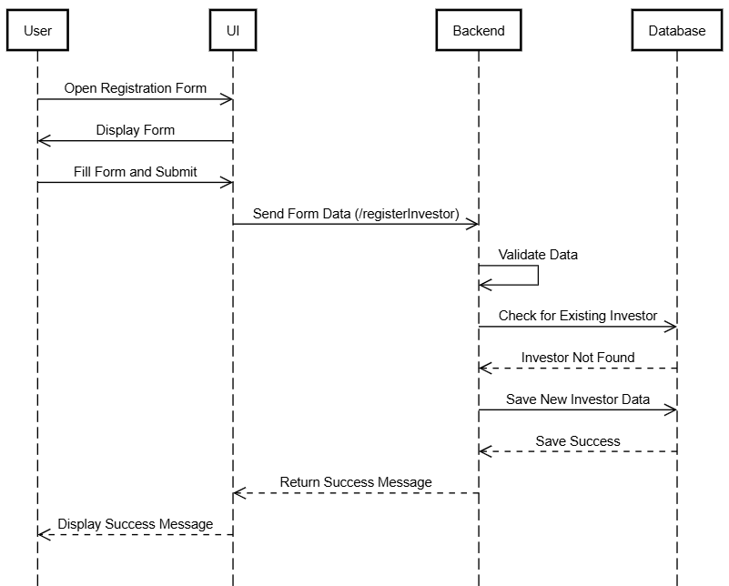

# Sequence Diagram: Create Investor

```mermaid
sequenceDiagram
    participant Investor
    participant Frontend
    participant Backend
    participant Database

    Investor->>Frontend: Fill in investor details
    Frontend->>Backend: Send investor details
    Backend->>Database: Save investor details
    Database-->>Backend: Confirm save
    Backend-->>Frontend: Confirm creation
    Frontend-->>Investor: Display confirmation
```

