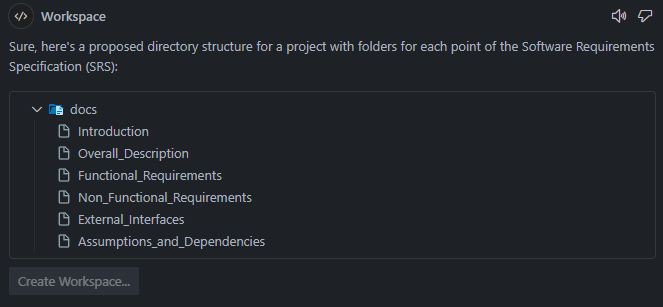

## 💻Activity

Using GitHub Copilot for Specification Creation in SRS Documentation.

## 🎯General Objective

To demonstrate how GitHub Copilot can assist in creating Software Requirements Specification (SRS) documents, it can help streamline the process by suggesting clear, concise language for requirement descriptions, functional specifications, and use case scenarios. 

## Specific Objectives

- **Create a technical specification document using GitHub Copilot**:
  - Generate an initial structure of the specification document.
  - Automate the drafting of common sections such as functional requirements, non-functional requirements, and system architecture.

## ℹ️ Requirements

- VS Code
- GitHub Copilot License
- GitHub Copilot Extension
- PlantUML Extension

## Step 1: Giving Context to Copilot

👤 Prompt:

```
Please help me generate a Software Requirements Specification (SRS) document for a web application called TaskFlow. The application is designed for task management in work teams. The SRS should include the following sections:_

1. **Introduction**

    - Purpose: Describe the goal of the TaskFlow application and why it is being developed.
    - Scope: Define the boundaries of the TaskFlow application, including its main features and functionalities.
    - Definitions and Acronyms: Include key terms used in the document, such as "task," "project," and "user role."
    - References: List any related documents or standards.
2. **Overall Description**

    - Product Perspective: Explain how TaskFlow fits into the larger context of task management tools.
    - Product Functions: Summarize the main features of TaskFlow, including project creation, task assignment, deadline management, file attachments, and user communication through comments.
    - User Classes and Characteristics: Describe the different types of users (e.g., administrators, team members) and their interactions with the system.
    - Constraints: Note any design constraints, such as technology stack or browser support.
3. **Functional Requirements**

    - Detailed requirements for user registration and authentication.
    - Requirements for creating and managing projects and tasks.
    - Requirements for file attachments and commenting on tasks.
    - Notification system requirements.
4. **Non-Functional Requirements**

    - Performance: Expected response times and load handling.
    - Security: Authentication, data protection, and access control measures.
    - Scalability: Ability to handle growth in users and data.
    - Availability: Expected uptime and reliability.
5. **External Interfaces**

    - User Interface: Overview of the web interface design and user experience.
    - File Storage Integration: Details about integration with file storage services.
    - Notification System: Integration with notification services or platforms.
6. **Assumptions and Dependencies**

    - Any assumptions about user access and system deployment.
    - Dependencies on external systems or technologies.

Please let me know If you understand this information before to give me the full document and then I can give you context about my app called TaskFlow
```

🤖 Copilot Answer:

```
Sure, I understand the structure you need for the Software Requirements Specification (SRS) document for TaskFlow. Please provide the specific details about your application, and I will help you generate the document accordingly. Here are some questions to get started:

1. **Introduction**

    - **Purpose**: What is the primary goal of TaskFlow? Why is it being developed?
    - **Scope**: What are the main features and functionalities of TaskFlow?
    - **Definitions and Acronyms**: What key terms should be included?
    - **References**: Are there any related documents or standards?
2. **Overall Description**

    - **Product Perspective**: How does TaskFlow fit into the larger context of task management tools?
    - **Product Functions**: What are the main features of TaskFlow?
    - **User Classes and Characteristics**: Who are the different types of users, and how do they interact with the system?
    - **Constraints**: Are there any design constraints, such as technology stack or browser support?
3. **Functional Requirements**

    - **User Registration and Authentication**: What are the detailed requirements?
    - **Project and Task Management**: What are the requirements for creating and managing projects and tasks?
    - **File Attachments and Commenting**: What are the requirements for file attachments and commenting on tasks?
    - **Notification System**: What are the requirements for the notification system?
4. **Non-Functional Requirements**

    - **Performance**: What are the expected response times and load handling?
    - **Security**: What are the authentication, data protection, and access control measures?
    - **Scalability**: What is the ability to handle growth in users and data?
    - **Availability**: What is the expected uptime and reliability?
5. **External Interfaces**

    - **User Interface**: What is the overview of the web interface design and user experience?
    - **File Storage Integration**: What are the details about integration with file storage services?
    - **Notification System**: What are the details about integration with notification services or platforms?
6. **Assumptions and Dependencies**

    - **Assumptions**: What are the assumptions about user access and system deployment?
    - **Dependencies**: What are the dependencies on external systems or technologies?

Please provide the necessary details for each section, and I will help you draft the SRS document.
```

Ensure copilot understands your request before proceeding

👤 Prompt:

```
I’m building a web application called **TaskFlow** is being developed for task management in work teams. The application will allow users to create projects, assign tasks, set deadlines, and track progress. Users will be able to collaborate, attach files, and communicate through comments on each task. Additionally, the application must have a notification system and user role management.

Before generate any content please Let me know if you understand the context of my app and then I will write you new prompts
```

🤖 Copilot Answer:

```
Yes, I understand the context of your application, TaskFlow. It is a web application designed for task management in work teams, allowing users to create projects, assign tasks, set deadlines, track progress, collaborate, attach files, and communicate through comments. It also includes a notification system and user role management.

Please provide the specific details for each section of the SRS document, and I will help you generate the content accordingly.
```

## Step 2: Create Project Structure

👤 Prompt:

```
@workspace /new now that you have the context, generate an project structure named `docs` and create a folder by each point of the Software Requirements Specification (SRS) Introduction, Overall Description, Functional Requirements, Non-Functional Requirements, External Interfaces and Assumptions and Dependencies
```

🤖 Copilot Answer:



## Step 3: Creating the Introduction

Tell to copilot to help you generate the introduction.

👤 Prompt:

```
@workspace Good job! now we can continue generating the Software Requirements Specification (SRS) document about the taskflow app. Lets start with the Introduction section, please create a markdown file named `Introduction`
```

🤖Copilot Answer:

```markdown
# Introduction

## Purpose

The purpose of this document is to provide a detailed Software Requirements Specification (SRS) for the Taskflow app. This document outlines the functional and non-functional requirements, overall description, external interfaces, and assumptions and dependencies of the Taskflow app.

## Scope

The Taskflow app is a task management application designed to help users organize and prioritize their tasks efficiently. The app will provide features such as task creation, categorization, prioritization, and reminders.

## Definitions, Acronyms, and Abbreviations

- **Task**: A piece of work to be done or undertaken.
- **User**: An individual who uses the Taskflow app.
- **SRS**: Software Requirements Specification.

## References

- [IEEE Std 830-1998](https://ieeexplore.ieee.org/document/720574): IEEE Recommended Practice for Software Requirements Specifications.

## Overview

This document is structured as follows:

- **Overall Description**: Provides a high-level overview of the Taskflow app, including its context and major functions.

- **Functional Requirements**: Details the specific functionalities that the Taskflow app must provide.

- **Non-Functional Requirements**: Specifies the performance, usability, reliability, and other non-functional attributes of the Taskflow app.

- **External Interfaces**: Describes the interfaces between the Taskflow app and other systems or components.

- **Assumptions and Dependencies**: Lists the assumptions and dependencies that affect the requirements and development of the Taskflow app.
```

## Step 4: Generate Overall Description Section

At this point, we can ask to copilot for the main users of the system/app, this information we are going to need it in this step.

👤Prompt:

```
@workspace what are the main users of this taskflow app
```

Copilot should answer something like this :

```
The main users of the Taskflow app can be categorized as follows:

1. **Individual Users**: People who use the app to manage their personal tasks and to-do lists.
2. **Team Members**: Individuals who use the app to collaborate on tasks and projects within a team.
3. **Project Managers**: Users who oversee multiple tasks and projects, assign tasks to team members, and track progress.
4. **Administrators**: Users who manage user accounts, permissions, and overall app settings.

These user roles can help in defining specific requirements and functionalities tailored to each type of user.
```

Now, we can tell to copilot to generate the next section of our document: **Overall Description**

👤Prompt:

```
@workspace now please generate the next section of our document `Overall Description` specifying Product Perspective, Product Functions, User classes and charateristics, Constraints
```

🤖Copilot Answer:

```
# Overall Description

## Product Perspective

The Taskflow app is a standalone task management application designed to help users organize and prioritize their tasks efficiently. It is intended to be used by individuals, teams, and project managers to streamline task management and improve productivity. The app will integrate with calendar applications and email services to provide seamless task scheduling and notifications.


## Product Functions

The main functions of the Taskflow app include:

**Task Creation**: Users can create new tasks with details such as title, description, due date, and priority.


**Task Categorization**: Users can categorize tasks into different projects or groups.

**Task Prioritization**: Users can set priority levels for tasks to manage their importance.


**Reminders and Notifications**: Users receive reminders and notifications for upcoming tasks and deadlines.


**Collaboration**: Team members can collaborate on tasks, assign tasks to each other, and track progress.


**Reporting**: Users can generate reports on task completion, overdue tasks, and overall productivity.


## User Classes and Characteristics

The main user classes for the Taskflow app are:

**Individual Users**: People who use the app to manage their personal tasks and to-do lists. They require an intuitive interface and easy task management features.

**Team Members**: Individuals who use the app to collaborate on tasks and projects within a team. They need features for task assignment, progress tracking, and communication.


**Project Managers**: Users who oversee multiple tasks and projects, assign tasks to team members, and track progress. They require advanced reporting and task management features.


**Administrators**: Users who manage user accounts, permissions, and overall app settings. They need access to administrative tools and user management features.

## Constraints

The development and operation of the Taskflow app are subject to the following constraints:

Platform Compatibility: The app must be compatible with major operating systems (Windows, macOS, iOS, Android) and web browsers.

Performance: The app must provide a responsive user experience with minimal latency.

Security: The app must ensure data security and privacy for all users, including secure authentication and data encryption.

Scalability: The app must be able to handle a growing number of users and tasks without performance degradation.

Compliance: The app must comply with relevant regulations and standards, such as GDPR for data protection
```

## Step 5: Functional Requirements

Tell to copilot to generate the functional requirements

👤Prompt:

```
@workspace now continue with the next section `Functional Requirements`. Generate a list of all functional requirements of this taskflow system in a markdown file `Functional Requirements`. Each functional requirement must have this structure:

1. ID
2. Description
3. List of specific requirements
```

🤖Copilot Answer:

```markdown
# Functional Requirements

## FR1: Task Creation

**Description**: The system shall allow users to create new tasks.

- FR1.1: The system shall provide a form to enter task details such as title, description, due date, and priority.
- FR1.2: The system shall allow users to save the created task.
- FR1.3: The system shall display the newly created task in the task list.

## FR2: Task Categorization

**Description**: The system shall allow users to categorize tasks into different projects or groups.

- FR2.1: The system shall provide an option to assign tasks to specific projects or groups.
- FR2.2: The system shall allow users to create new categories for tasks.
- FR2.3: The system shall display tasks under their respective categories.

## FR3: Task Prioritization

**Description**: The system shall allow users to set priority levels for tasks.

- FR3.1: The system shall provide options to set priority levels such as high, medium, and low.
- FR3.2: The system shall display tasks with their priority levels.

## FR4: Reminders and Notifications

**Description**: The system shall provide reminders and notifications for upcoming tasks and deadlines.

- FR4.1: The system shall allow users to set reminders for tasks.
- FR4.2: The system shall send notifications to users for upcoming tasks and deadlines.
- FR4.3: The system shall display reminders in the task list.

## FR5: Collaboration

**Description**: The system shall allow team members to collaborate on tasks.

- FR5.1: The system shall allow users to assign tasks to other team members.
- FR5.2: The system shall provide a way for team members to comment on tasks.
- FR5.3: The system shall display the assigned tasks to the respective team members.

## FR6: Reporting

**Description**: The system shall provide reporting features for task completion, overdue tasks, and overall productivity.

- FR6.1: The system shall generate reports on task completion.
- FR6.2: The system shall generate reports on overdue tasks.
- FR6.3: The system shall generate reports on overall productivity.

## FR7: User Management

**Description**: The system shall provide user management features for administrators.

- FR7.1: The system shall allow administrators to create and manage user accounts.
- FR7.2: The system shall provide options to set user permissions.
- FR7.3: The system shall allow administrators to deactivate or delete user accounts.

## FR8: Integration with Calendar and Email

**Description**: The system shall integrate with calendar applications and email services.

- FR8.1: The system shall sync tasks with calendar applications.
- FR8.2: The system shall send task notifications via email.
- FR8.3: The system shall allow users to import tasks from email.
```

Save this content in a file named `Functional_Requirements.md` inside the `Functional_Requirements` folder.

## Step 6: Use Cases

In this section we are generating system actors, use cases and use cases diagrams using copilot

Tell to copilot to identify the main actors

👤 Prompt:

```
@workspace Now based on the Functional requirements identify the main actors of the taskflow system. For each actor give me the name of the actor and a brief description
```

🤖Copilot Answer:

```
Based on the functional requirements, the main actors of the Taskflow system are:

1. **Individual User**

    - **Description**: An individual user is someone who uses the Taskflow app to manage their personal tasks and to-do lists. They can create, categorize, prioritize tasks, and set reminders and notifications.
2. **Team Member**

    - **Description**: A team member is an individual who collaborates with others on tasks and projects within a team. They can assign tasks to other team members, comment on tasks, and track task progress.
3. **Project Manager**

    - **Description**: A project manager oversees multiple tasks and projects, assigns tasks to team members, and tracks progress. They require advanced reporting and task management features to monitor productivity and task completion.
4. **Administrator**

    - **Description**: An administrator manages user accounts, permissions, and overall app settings. They have access to administrative tools and user management features, including creating and managing user accounts, setting permissions, and deactivating or deleting user accounts.

These actors interact with the system to perform various tasks and utilize different features as outlined in the functional requirements.
```

#### Create Actors document with their responsibilities, restrictions and use cases

👤Prompt:

```
@workspace based on the actors of the system create the documentation file for each one of them. Containing the following information:

1.A Detailed description of the actor.
2. The responsibilities of the actor.
3. The restrictions of the actor.
4. All the business rules applied to him.
5. All the use cases of the actor.
```

Copilot will give you an answer like this, by each of the actor of the system

```
# Individual User

## Detailed Description

An individual user is someone who uses the Taskflow app to manage their personal tasks and to-do lists. They can create, categorize, prioritize tasks, and set reminders and notifications.


## Responsibilities

- Create and manage personal tasks.

- Categorize tasks into different projects or groups.

- Set priority levels for tasks.

- Set reminders and receive notifications for tasks.

## Restrictions

- Cannot assign tasks to other users.

- Limited to managing only their own tasks.

## Business Rules

- An individual user must have an account to use the app.

- Tasks created by an individual user are private and not visible to other users unless shared.

## Use Cases

- Create a new task.

- Categorize a task.

- Set task priority.

- Set task reminders.

- Receive task notifications.
```

Save the document in a `Functional_Requirements/Actors` folder

#### Create use cases by each actor

👤 Prompt:

```
@workspace Based on the business rules of this application/system, and also taking in count the documentation of the actors of the system #file:Individual User.md , #file:Team Member.md, #file:Project Manager.md and #file:Administrator.md Create the Use Cases documents in a markdown file for each actor of the system. The use cases file must contain a table for each use case and inside the table will be a step by step description of the use case, also the use case shoud specify the prerequisites to be completed and the expected outcome.
```

🤖 Copilot Answer:
Copilot will give you an answer like this, by each actor

```
# Individual User Use Cases


## Use Case: Create a New Task


| Step | Description |

|------|-------------|

| 1    | User logs into the Taskflow app. |

| 2    | User navigates to the task creation form. |

| 3    | User enters task details such as title, description, due date, and priority. |

| 4    | User saves the task. |

| 5    | System displays the newly created task in the task list. |


**Prerequisites**: User must be logged into the Taskflow app.


**Expected Outcome**: A new task is created and displayed in the task list.


## Use Case: Categorize a Task


| Step | Description |

|------|-------------|

| 1    | User logs into the Taskflow app. |

| 2    | User selects a task from the task list. |

| 3    | User assigns the task to a specific project or group. |

| 4    | System updates the task category. |


**Prerequisites**: User must be logged into the Taskflow app and have an existing task.


**Expected Outcome**: The task is categorized under the specified project or group.


## Use Case: Set Task Priority


| Step | Description |

|------|-------------|

| 1    | User logs into the Taskflow app. |

| 2    | User selects a task from the task list. |

| 3    | User sets the priority level for the task (e.g., high, medium, low). |

| 4    | System updates the task priority. |


**Prerequisites**: User must be logged into the Taskflow app and have an existing task.


**Expected Outcome**: The task priority is updated.


## Use Case: Set Task Reminders


| Step | Description |

|------|-------------|

| 1    | User logs into the Taskflow app. |

| 2    | User selects a task from the task list. |

| 3    | User sets a reminder for the task. |

| 4    | System schedules the reminder. |


**Prerequisites**: User must be logged into the Taskflow app and have an existing task.


**Expected Outcome**: A reminder is set for the task.


## Use Case: Receive Task Notifications


| Step | Description |

|------|-------------|

| 1    | System sends a notification for an upcoming task. |

| 2    | User receives the notification. |


**Prerequisites**: User must have set reminders for tasks.


**Expected Outcome**: User receives notifications for upcoming tasks.
```

Save file as `Individual_User_Use_Cases.md` in `Functional_Requirements/UseCases`

## Step 7: Use Case Diagrams

👤 Prompt:

```
@workspace Can you give me the first use case for the Individual User Actor ? #file:Individual_User_Use_Cases.md
```

🤖 Copilot Answer:

```
Certainly! Here is the first use case for the Individual User actor from the Individual_User_Use_Cases.md file:

## Use Case: Create a New Task

|Step|Description|
|---|---|
|1|User logs into the Taskflow app.|
|2|User navigates to the task creation form.|
|3|User enters task details such as title, description, due date, and priority.|
|4|User saves the task.|
|5|System displays the newly created task in the task list.|

**Prerequisites**: User must be logged into the Taskflow app.

**Expected Outcome**: A new task is created and displayed in the task list.
```

👤 Prompt:

```
@workspace Generate a PlantUML use case diagram for the `Create a New Task` use case from the file #file:Individual_User_Use_Cases.md and show the interactions between the User and the system in a clear sequence, with appropriate use cases for each step.
```

🤖 Copilot Answer:

```
@startuml
actor User

rectangle TaskflowApp {
    usecase "Log into the Taskflow app" as UC1
    usecase "Navigate to the task creation form" as UC2
    usecase "Enter task details" as UC3
    usecase "Save the task" as UC4
    usecase "Display the newly created task" as UC5
}

User -> UC1
User -> UC2
User -> UC3
User -> UC4
UC4 -> UC5

@enduml
```

👤 Prompt:

```
@workspace Can you do the same for the rest of the use cases from the actor #file:Individual_User_Use_Cases.md
```

Categorize a Task

```
@startuml
actor User

rectangle TaskflowApp {
    usecase "Log into the Taskflow app" as UC1
    usecase "Select a task from the task list" as UC2
    usecase "Assign the task to a specific project or group" as UC3
    usecase "Update the task category" as UC4
}

User -> UC1
User -> UC2
User -> UC3
UC3 -> UC4

@enduml
```

Set Task Priority

```
@startuml
actor User

rectangle TaskflowApp {
    usecase "Log into the Taskflow app" as UC1
    usecase "Select a task from the task list" as UC2
    usecase "Set the priority level for the task" as UC3
    usecase "Update the task priority" as UC4
}

User -> UC1
User -> UC2
User -> UC3
UC3 -> UC4

@enduml
```

Set Task Reminders

```
@startuml
actor User

rectangle TaskflowApp {
    usecase "Log into the Taskflow app" as UC1
    usecase "Select a task from the task list" as UC2
    usecase "Set a reminder for the task" as UC3
    usecase "Schedule the reminder" as UC4
}

User -> UC1
User -> UC2
User -> UC3
UC3 -> UC4

@enduml

```

Receive Task Notifications

```
@startuml
actor User

rectangle TaskflowApp {
    usecase "Send a notification for an upcoming task" as UC1
    usecase "Receive the notification" as UC2
}

UC1 -> UC2
User -> UC2

@enduml
```

Save these diagrams in the respective files inside the `Diagrams/UseCases/Individual_User` folder:

create-task.plantuml
categorize-task.plantuml
set-task-priority.plantuml
set-task-reminders.plantuml
receive-task-notifications.plantuml

Tell to copilot to do the same with the rest of actors

```
@workspace now please do the same of the previous steps and generate the use cases diagrams for the actor #file:Project_Manager_Use_Cases.md
```

## Step 8: No Functional Requirements

👤 Prompt:

```
@workspace continue with the next section of our document, please create a markdown file named `NonFunctionalRequirements.md` inside the `Doc` folder. In this file, include the following structure:
```

## Step 9: External Interfaces

```
@workspace Help me generate the "External Interfaces" section for our Software Requirements Specification (SRS) document. The section should include:

1. User Interface: Describe the web interface, highlighting that it is responsive and accessible via modern browsers.
2. Communication Interfaces: Describe the use of a REST API for communication between the frontend and backend, using HTTPS and JSON.
```

You can save this content in a file named External_Interfaces.md inside the `External_Interfaces` folder

## Step 10: Assumptions and Dependencies

```
@workspace now can you please continue with the Assumptions and Dependencies section
```

Save this content in a file named `Assumptions_and_Dependencies.md` inside the `Assumptions_and_Dependencies` folder.
